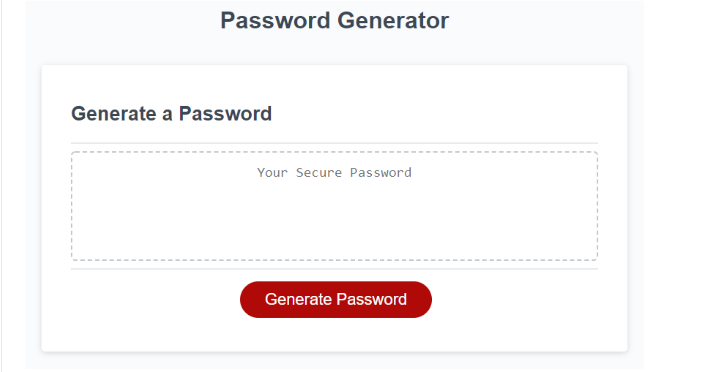

# passwordGenerator

## Description
The challenge was to add onto the existing code to have it generate random passwords for greater security. It has a series of prompts to choose how long you want the password, and the character types you want included. (The password has to be between 8 and 128 characters and include at least one character type.) When you click the button and answer the promts it displays the generated password in the box.

